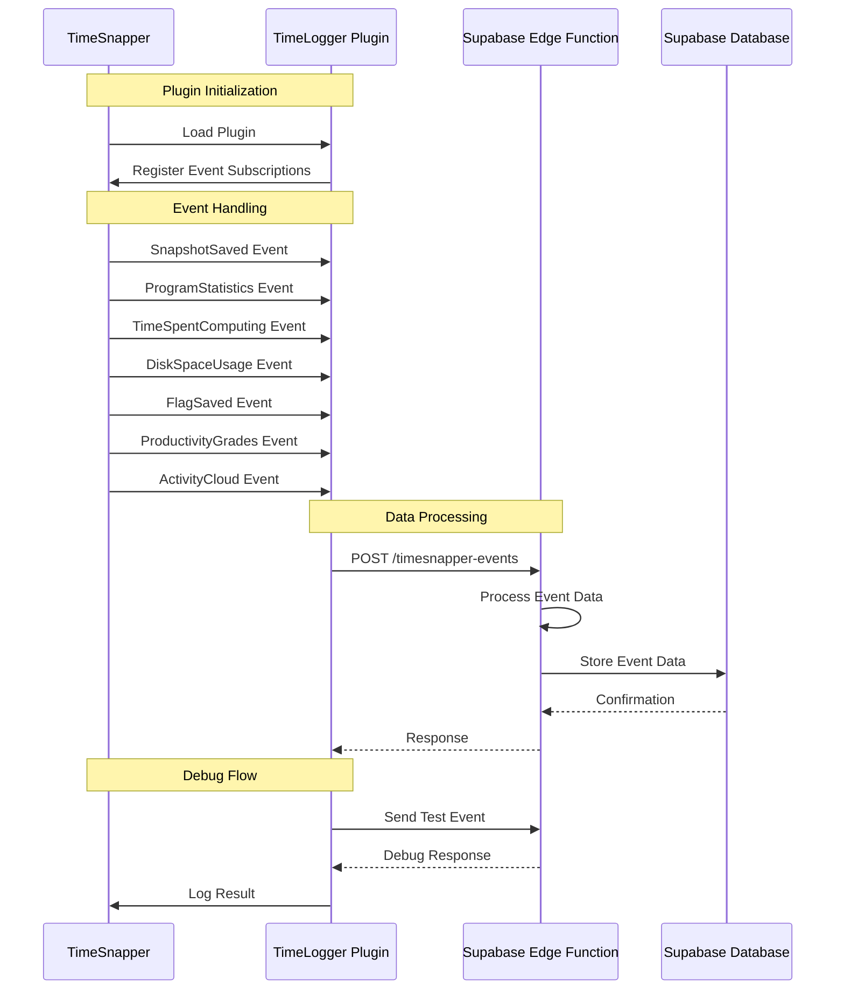

# TimeSnapper Plugin Flow Diagram

## Component Details

### TimeSnapper
- Hosts the plugin
- Generates various events
- Provides plugin infrastructure

### TimeLogger Plugin
- Implements ITimeSnapperPlugIn interface
- Subscribes to TimeSnapper events
- Formats and sends data to Supabase
- Includes debug capabilities

### Supabase Edge Function
- Endpoint: `/timesnapper-events`
- Processes incoming event data
- Validates payload
- Stores data in database

### Supabase Database
- Stores all TimeSnapper events
- Maintains event history
- Supports querying for analytics

## Event Types

1. **SnapshotSaved**
   - Screen capture data
   - Timestamp
   - Active window info

2. **ProgramStatistics**
   - Application usage
   - Time per program
   - Activity patterns

3. **TimeSpentComputing**
   - Total active time
   - Idle periods
   - Work patterns

4. **DiskSpaceUsage**
   - Storage metrics
   - Snapshot sizes
   - Cleanup recommendations

5. **FlagSaved**
   - User-defined markers
   - Important moments
   - Custom annotations

6. **ProductivityGrades**
   - Activity scoring
   - Productivity metrics
   - Performance indicators

7. **ActivityCloud**
   - Activity summaries
   - Common tasks
   - Frequency analysis

## Data Flow

1. TimeSnapper generates events
2. Plugin receives events via HandleEvent
3. Plugin formats data as JSON
4. Data sent to Supabase edge function
5. Edge function processes and stores data
6. Response logged for debugging

## Debug Features

- Test event generation
- Response validation
- Error logging
- Event verification